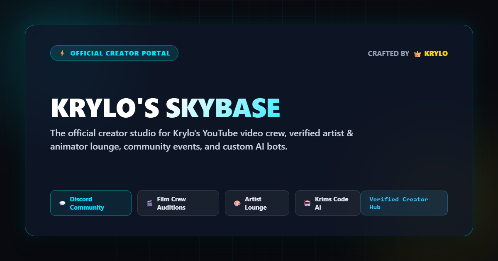

# 👑 Krylo's Skybase • Official Creator Hub

  

    

  
  
  

---

## ⚡ Overview
The official community web hub and creator portal for **Krylo's Skybase**.
Built from the ground up with native Discord Open Graph (OG) integration for rich visual preview cards.

## 🌟 Key Features
- **Discord Rich Embeds:** Complete Open Graph metadata (`og:title`, `og:image`, `theme-color: #00E5FF`).
- **Creator Studio Hub:** Direct access to YouTube Film Crew Auditions and Casting Calls.
- **Verified Artist Lounge:** Studio for community emoji and sticker creators.
- **Krims Code AI Hub:** Bot command reference, leveling stats, and custom bot tools.
- **Ultra-Lightweight & Fast:** Responsive, zero bloat, mobile-optimized glassmorphism UI.

---

Crafted with ⚡ and pride by **Krylo**.
